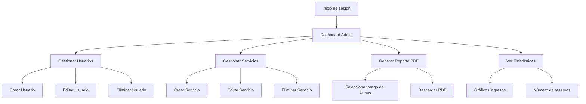
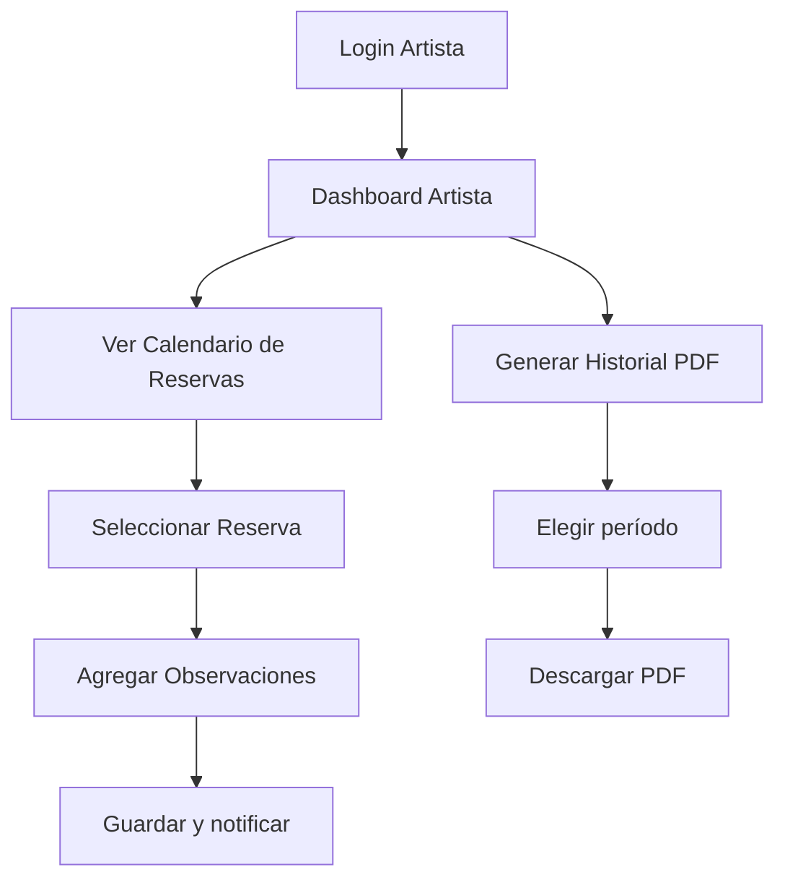
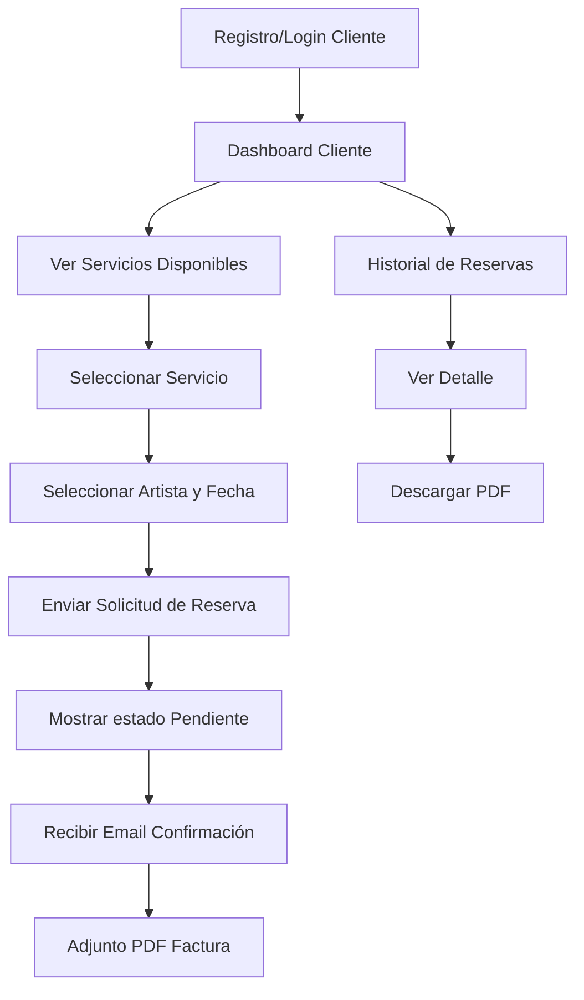
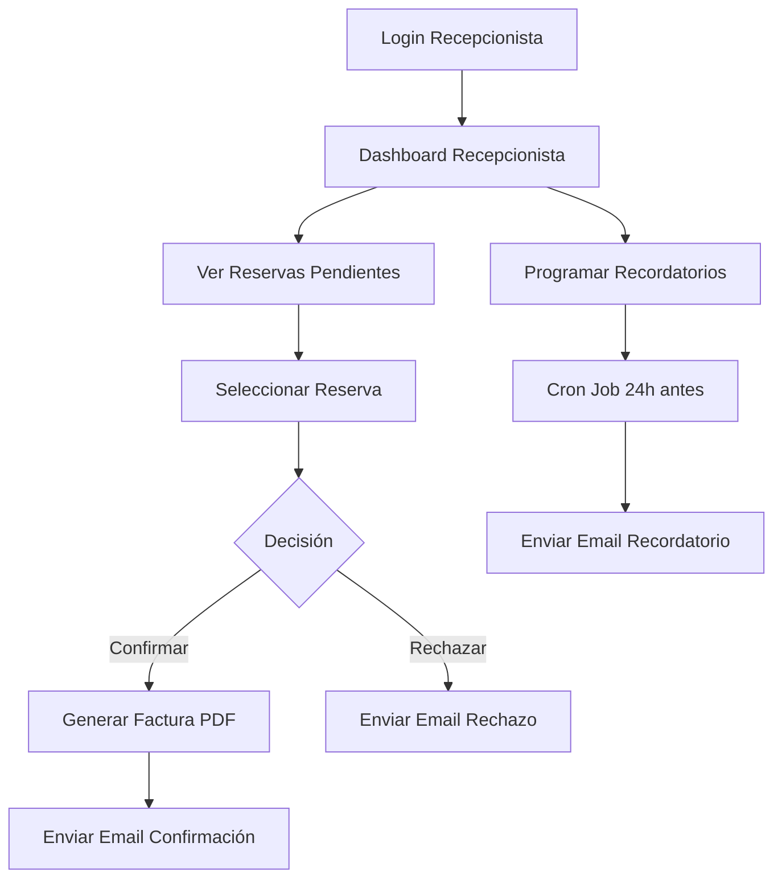

# UserFlow.md

Este documento describe los flujos de usuario (user flows) para cada uno de los roles del sistema: Administrador, Artista, Cliente y Recepcionista. Se incluyen diagramas en Mermaid para visualizar el recorrido de cada actor.

---

## 1. Administrador

### Flujos principales

1. **Autenticación**
2. **Gestión de usuarios** (CRUD)
3. **Gestión de servicios** (CRUD)
4. **Generación de reportes PDF**
5. **Visualización de estadísticas**

---

## 2. Artista

### Flujos principales

1. **Login**
2. **Ver calendario de reservas**
3. **Actualizar estado de reserva y observaciones**
4. **Generar historial de trabajo (PDF)**

---

## 3. Cliente

### Flujos principales

1. **Registro / Login**
2. **Seleccionar servicio y artista**
3. **Reservar cita**
4. **Recibir confirmación y PDF**
5. **Ver historial de reservas**

---

## 4. Recepcionista

### Flujos principales

1. **Login**
2. **Ver reservas pendientes**
3. **Confirmar/Rechazar reserva**
4. **Enviar recordatorio 24h antes**

